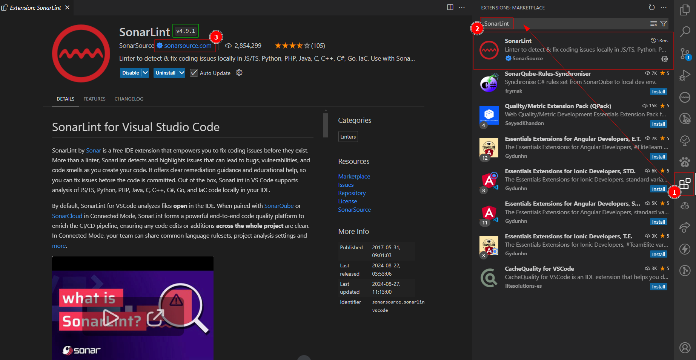

# HttpProxy

Este recurso nos permite abstraer las consultas hacia apis.

## Contexto&#x20;

La arquitectura actual tiene dos capas, apis externas (experiencia) e internas (negocio) y esto tipo de arquitecturas posee los siguientes retos.

* Saber organizar los enpoints de cada api.
* Al consumir un api se debe crear la URL (query, params) y el body.
* Cuando se consume una mismo endpoint en más de dos lugares se repite las definiciones.
* Cada desarrollador organiza sus apis como mejor le parezca.
* Poder consumir apis de otras celulas es complicado.

La siguiente imagen muestra una abstracción de la arquitectura de apis y células, cada vez que se crean nuevas apis se vuele complicado de mantener y escalar, generando código duplicado en muchos casos.

<figure><figcaption><p>Resumen de la arquitectura entre células</p></figcaption></figure>

Adicional a ello, el consumo de las apis debe ser un estándar para todas las células, donde todos deben cumplir con los requerimientos de Seguridad y Calidad.

Por ello, se propone esta sección donde presentan estructuras, clases, ejemplos, etc.

## HttpProxy

Esta clase nos ayuda a crear un intermediario entre el consumidor y la api. Esto se realiza por los siguientes motivos:

* Imprimir los datos necesarios para hacer soporte.
* Validar parámetros obligatorios como rqId, basicAuth.
* Hacer envió de datos hacia una **api\_track** para generar diagramas (solo en DEV).
* Abstraer la forma en la que se consumen las apis, es decir se en un futuro se quiere cambiar el uso de axios a fetch será más fácil y transparente para los desarrolladores.
* Enviar los datos como objetos ya sea en los parámetros y query.

### Recomendaciones

* Si la api es <mark style="background-color:green;">especifica</mark> de la célula, se recomienda crearlo en una librería de la célula.
* Si la api es <mark style="background-color:yellow;">compartida</mark> o general, se recomienda crearlo en una librería general para todas las células, ejemplo api de seguridad.
* Las apis deben definirse en typescript para tener los tipos de datos en el input y output de cada api.

<figure><figcaption></figcaption></figure>

### Módulo

Para hacer uso de la clase HttpProxy este primero debe estar asociado a un [módulo ](guias-detalladas/modules/)de la Api a la cual hace referencia.

* Se tiene que crear un archivo \<name\_module>.api.module.ts
* Se crear la clase que extiende de HttpProxy con la nomenclatura `<Name>ApiModule`
* Se pasar tiene que pasar el nombre del módulo en el contructor super.
* Se define los métodos de ese modulo con su interfaz en el input y output.

### SendRequest

&#x20;Este método de la clase heredada nos permite hacer él envió de las peticiones donde se tiene que pasar los siguientes parámetros.

<table><thead><tr><th width="146">Campo</th><th width="229">Tipo</th><th>Descripción</th></tr></thead><tbody><tr><td>method</td><td><p></p><pre class="language-typescript"><code class="lang-typescript">'POST'
'PUT'
'GET'
'DELETE'
</code></pre></td><td>Método Http</td></tr><tr><td>resource</td><td>string</td><td>Nombre del recurso</td></tr><tr><td>rqId</td><td>uuid</td><td>Identificador de la petición</td></tr><tr><td>body?</td><td>Object</td><td>Input body </td></tr><tr><td>params?</td><td>Object</td><td>Parámetros URL</td></tr><tr><td>query?</td><td>Object</td><td>Parámentros URL query</td></tr></tbody></table>



```typescript
export class NameApiModule extends HttpProxy {
  constructor() {
    super('name_module')
  }

  /** @description Description */
  async methodExample(input: exampleInput, rqId: string): Promise<exampleResponse> {
    return this.sendRequest({
      method: 'GET',
      resource: 'get_example',
      body: { id }
      rqId,
    })
  }
}

export const nameApiModule = new NameApiModule()
```



Para un ejemplo más realista usamos las rutas definidas en la [sección anterior](guias-detalladas/modules/routes.md#ejemplos) donde se tiene un api negocio de clientes.



```typescript
export class ClientApiModule extends HttpProxy {
  constructor() {
    super('client')
  }

  /** @description Obtine un cliente por su id */
  async getById(input: GetByIdInput, rqId: string): Promise<GetByIdResponse> {
    const { id, idv2, idParam, test } = input
    return this.sendRequest({
      method: 'POST',
      resource: 'get_by_id',
      body: { id },
      query: { idv2  },
      params: { id: idParam, test },
      rqId,
    })
  }
}

export const clientApiModule = new ClientApiModule()

interface GetByIdInput {
  id: number
  idv2: string
  idParam: string
  test: string
}

interface GetByIdResponse {
  name: string
  mail: string
}
```



### Relación Routes

En la siguiente imagen muestra la relación entre un HttpProxy y las Rutas del api a la cual hace referencia.

<figure><figcaption><p>Relación entre HttpProxy (Izquierda) con una Api (derecha)</p></figcaption></figure>

### Usar ApiModule

Para usar api module en una api se tiene que pasar los siguientes parámetros usando la función **setProps**.

> 🤔 Por que usar una función en lugar del constructor? Esto se debe a que los parámetros son obtenidos como secretos por una función asíncrona. Un constructor no puede ejecutar funciones asíncronas y tampoco puede esperar a que termine.

<table><thead><tr><th width="146">Campo</th><th width="229">Tipo</th><th>Descripción</th></tr></thead><tbody><tr><td>baseUrl</td><td>string</td><td>URL base de la api, por ejemplo <br><a href="https://bttccslab006.azurekl.net/portaltest-">https://bttccslab006.azurekl.net/portaltest-</a> </td></tr><tr><td>basicAuth</td><td>string</td><td>Valor de la autorización Basic</td></tr><tr><td>localUrl</td><td>string</td><td>Url para hacer pruebas en local, ejemplo <br><a href="http://localhost:3000/">http://localhost:3000/</a> </td></tr><tr><td>apiName</td><td>string</td><td>Nombre de la api</td></tr></tbody></table>



```typescript
async function startApplication() {
  await secrets.uploadAll()

  clientApiModule.setProps({
    apiName: 'client',
    baseUrl: 'https://bttccslab006.azurekl.net/portaltest-',
    basicAuth: secrets.value.basicAuth,
    localUrl: 'http://localhost:3000/',
  })
  
  setRoutes(routes)
  const server = new ExternalServer({
    bearerStrategyOptions: {
      clientID: secrets.value.clientID,
      isB2C: secrets.value.isB2C === 'true',
      policyName: secrets.value.policyName,
      scope: secrets.value.scope,
      tenantName: secrets.value.tenantName,
      customDomainName: secrets.value.customDomainName,
    },
  })
  const app = await server.init(routes)
  app.listen(server.port, () => {
    console.log(server.messageListening)
  })
}

module.exports = startApplication
```




&#x20;&#x20;

