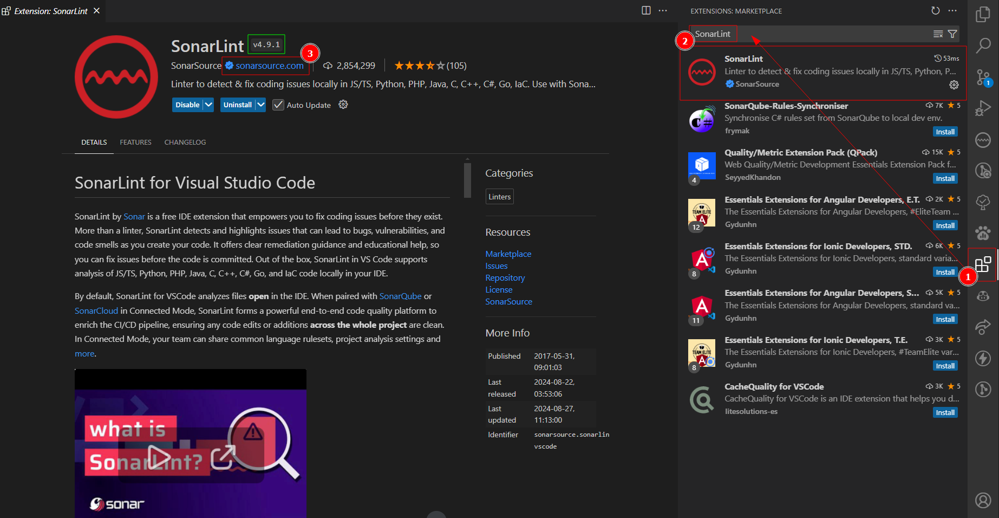

# SonarLint

## SonarCloud

Es necesario tener un usuario activo en SonarCloud, en caso de que no lo tenga comunicarse con el equipo de desarrollo.

### Login

Para ingresar a SonarCloud es necesario usar las credenciales de Azure Devops.

<figure><figcaption>
Login SonarCloud
</figcaption></figure>

### Tokens

Una vez logueado es necesario revisar la sección de token que se van a generar usando vsCode.

<figure><figcaption>
Token de su cuenta en SonarCloud
</figcaption></figure>

## Configuración VSCode

Se debe tener instalado el editor de codigo VSCode en su dispositivo con la última versión.

### Instalar Extensión

En el marketplace de VSCode se debe buscar el nombre **SonarLint.** Es importante verificar el dominio en azul **sonarsource.com**

<figure><figcaption>
Imagen de referencia para descargar la extension SonarLint
</figcaption></figure>

Una vez instalado le debe aparecer el icono de sonarlint en la barra de herramientas.

### Conectar con SonarCloud

Vamos al icono de la extensión, en la segunda sección **Modo de Conexión**, escogemos la segunda opción de **SonarCloud**. Esto nos va a dirigir a un nuevo panel.

<figure><figcaption>
Agregar Conexión SonarCloud
</figcaption></figure>

Una vez que se ha seleccionado SonarCloud, nos mostrara un panel para agregar los datos de conexión y/o **generar el token.** Vamos por el botón <mark style="background-color:blue;">Generate Token</mark>, esto nos va a dirigir a la web de sonarCloud en su navegador por defecto.&#x20;

<figure><figcaption>
Generar Token de Conexión
</figcaption></figure>

Una vez que acepte abrir el sitio web le puede mostrar dos opciones.

* [Iniciar Sesión](sonarlint.md#login), si no lo tiene en su navegador.
* Permitir la conexión con Cloud, si ya tiene iniciado la sesión.

<figure><figcaption>
Permitir conexión con SonarCloud
</figcaption></figure>

Cuando la conexión se hizo correctamente se mostrará un panel que todo está listo.

Se puede dirigir a VSCode en el panel de Nueva Conexión y se podrá dar cuenta que se autocompletaron los datos.

<figure><figcaption>
Autocompletado de datos en VsCode
</figcaption></figure>

Tambien puede ir a la seccion de [Tokens ](sonarlint.md#tokens)en SonarCloud, para ver su nuevo token creado. Algunas veces es necesario refrescar la página.

Finalmente, podrá visualizar el nombre de su conexión en VSCode.

<figure><figcaption>
Imagen de su conexión agregado correctamente.
</figcaption></figure>

### Agregar Proyecto

Para empezar a escanear un proyecto usando SonarLint.

* Abrimos el proyecto en VSCode de manera independiente, para el ejemplo usaremos \[V2-Usuarios]
* Vamos a la parte de conexiones en SonarLint y le damos en el botón enlazar proyecto \[1].&#x20;
* Esto nos mostrara todos los proyectos que se tiene en SonarCloud, buscamos y seleccionamos aquel que tenga el mismo nombre.

<figure><figcaption>
Seleccionar proyecto para enlazar
</figcaption></figure>

Con ello ya se tiene enlazado el proyecto local con su proyecto en SonarCloud. Esto lo puede hacer con todos los proyectos que tenga que desarrollar.

> 🙏 Si su proyecto no se encuentra en SonarCloud comuníquese de inmediato con el equipo de desarrollo o infraestructura.

Posteriormente, podrá visualizar su proyecto enlazado en la su conexión.

<figure><figcaption>
Proyecto enlazado correctamente.
</figcaption></figure>

## Uso de SonarLint

Cuando ya tiene configurado su proyecto y necesite escanear su código es necesario en enfocarze en la tercera sección de **Security HotSpots**.

### Elegir Opción de Escaneo

Se tiene dos opciones para escanear los archivos de su proyecto.

* In Open Files: útil para corregir algo puntual que le ha sido reportado. (no recomendable)
* **In Whole Folder**: útil para corregir todos los archivos del proyecto. (recomendable)

Por defecto la opción (In Open Files) se recomienda cambiarlo por la segunda opción.

<figure><figcaption>
Opción In Whole Folder
</figcaption></figure>

### Forzar Error

Para una prueba fácil agregamos una variable llamada **password** con un valor cualquiera y podremos ver en la sección de Security HotSpots los detalles del error.

<figure><figcaption>
Error potencial al tener credenciales en codigo. (SonarLint)
</figcaption></figure>

